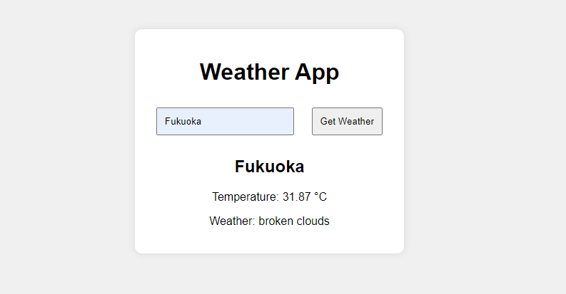

## Techchallenge1

## Setup
1. Clone the repository.
2. Open `index.html` in a browser.
3. Enter a location and click "Get Weather".

## Instructions
1. Replace `YOUR_API_KEY` in `app.ts` with your OpenWeatherMap API key.
2. Run `npx tsc` to compile the TypeScript file to JavaScript.
3. Open `index.html` in your browser to use the app.

